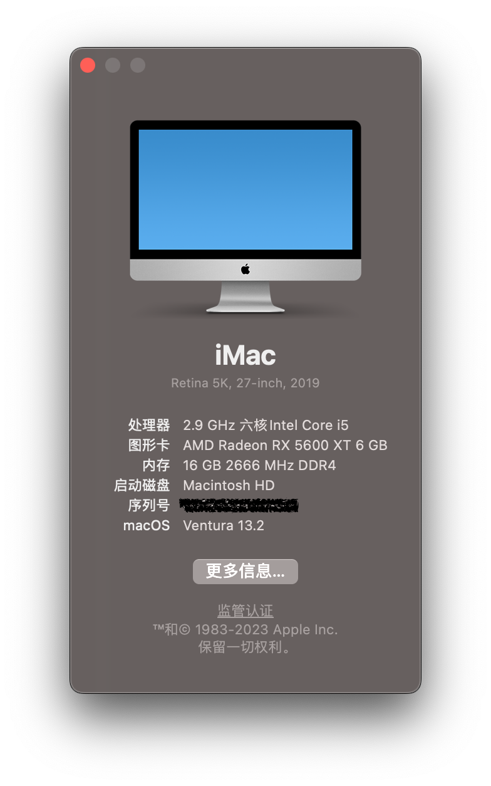

# ASUS-TUF-GAMING-B460M-PLUS-RX5600XT-Hackintosh-Opencore

# Configuration 
Opencore: 0.6.1  
Version: macOS Big Sur Beta  
Motherboard: ASUS TUF Gaming B460M PLUS (WIFI)  
Graphics: RX5600XT  
Wireless network card: BCM94360CD  



# Situation
Graphics：RX5600XT work well, UHD 630 not work  
Sound card：work well  
Wireless: wifi & Bluetooth work well, AX200 not work  
Sleep & wake：work well  
Location：work well  
NVRAM：work well  
USB：work well  (including usb2.0 and usb3.0)

# Issue tracking

```
Q: Sleep and wake error: Sleep Wake failure in EFI.
A: Run `sudo pmset -a standby 0` in terminal.
```
```
Q: Problem with the display scale of Opencore.
A: Change the value `UIScale` in NVRAM settings (also need to reset NVRAM and rebuild UEFI record).
```

# Reference

[1]: https://github.com/Swayyyyy/ASUS-TUF-GAMING-B460M-PLUS-RX570-Hackintosh-Opencore	"Swayyyyy/ASUS-TUF-GAMING-B460M-PLUS-RX570-Hackintosh-Opencore"

[2]: https://github.com/xiaoyaowx/Hackintosh-Z490-ASRock-Steel-Legend-Intel-10700	"xiaoyaowx/Hackintosh-Z490-ASRock-Steel-Legend-Intel-10700"

[3]: https://mp.weixin.qq.com/s/aUXfrHEAnr-myO_MdMkJOw	"小兵教大家如何识别黑苹果无线网卡"
[4]: https://www.insanelymac.com/forum/topic/340713-opencore-causes-uefi-to-post-in-safe-mode/	"OpenCore causes UEFI to POST in safe mode"
[5]: https://heipg.cn/tutorial/custom-usbports-for-hackintosh.html	"使用 Hackintool 定制黑苹果 USB 端口，适用于 Clover & OpenCore"
[6]: https://zhuanlan.zhihu.com/p/157200950	"黑苹果开荒记系统篇: 超详细的 OpenCore 纯净 MacOS 安装流程"
[7]: https://dortania.github.io/OpenCore-Post-Install/cosmetic/gui.html#setting-up-opencore-s-gui	"OpenCore beauty treatment"
[8]: https://discussions.apple.com/thread/250469185	"Error after having hard drive replaced: Sleep Wake failure in EFI"

